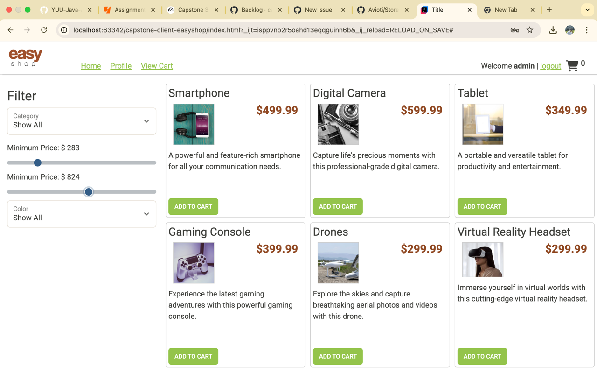

# EasyShop E-Commerce API (Capstone 3)

## 📖 Overview

EasyShop is a RESTful e-commerce API built with **Spring Boot** as part of the Java Development Final Capstone (Capstone 3).

The API supports:
- Product browsing and search
- Category management (admin only)
- Secure authentication using JWT
- Role-based access control
- Integration with a JavaScript frontend

---

## 🛠️ Tech Stack

- Java 17
- Spring Boot
- Spring Security (JWT Authentication)
- MySQL
- JDBC
- Maven
- Insomnia (API testing)

---
## Phase 1 – Product Search API
- Implemented public product search
- Supports filtering by category, price range, and subcategory
- Verified via frontend integration

## Phase 2 – Authentication & Authorization
- Implemented JWT-based authentication
- Role-based access control (ADMIN vs USER)
- Unauthorized users are blocked from protected endpoints
- Authorized users can log in and perform secured actions
- Frontend automatically attaches JWT to API requests

## Frontend Integration
- Frontend connects to Spring Boot API
- Products are loaded dynamically
- Login state is reflected in UI

## 📸 Application Screenshot

The screenshot below demonstrates the frontend successfully connected to the secured backend API after user authentication.

